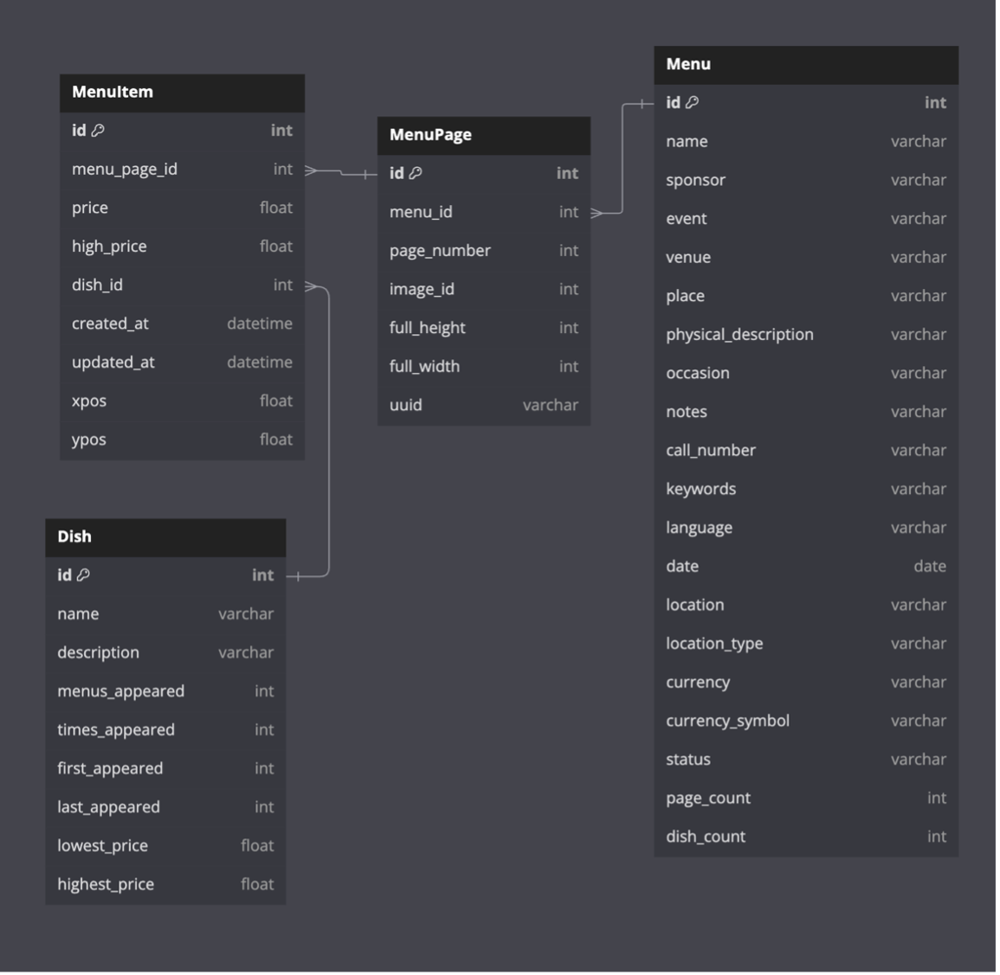

# NYPL Menus Data Cleaning Project

[](https://www.python.org/)
[](https://jupyter.org/)
[](https://pandas.pydata.org/)
[](https://openrefine.org/)
[](https://www.sqlite.org/)
[](https://github.com/)
[](https://opensource.org/licenses/MIT)

## Project Overview

This repository contains a comprehensive data cleaning project for the New York Public Library's (NYPL) "What's on the Menu?" historical menu dataset. The project processes approximately 45,000 menus dating from the 1840s to the present, providing insights into culinary and cultural trends over nearly two centuries.

### Main Use Case
**Analyzing Trends for the Top 10 Most Popular Dishes Per Year**
- Identify the most frequently appearing dishes on menus for each year (1840s–present)
- Examine how dish popularity changes over time
- Support research into culinary and cultural evolution

## Project Structure

```
NYPL-Menus-Data-Cleaning/
├── 📁 analysis/         # Data analysis and trend analysis
├── 📁 data/             # Raw and cleaned datasets
├── 📁 docs/             # Project documentation
├── 📁 img/              # Images and diagrams
├── 📁 openrefine/       # OpenRefine cleaning workflows
├── 📁 pandas/           # Python pandas cleaning scripts
└── 📁 workflow/         # Workflow diagrams and scripts
```

## Dataset Description

The dataset is structured into four main tables with the following relationships:

- **Menu** → **MenuPage** (one-to-many): Each menu can have multiple pages
- **MenuPage** → **MenuItem** (one-to-many): Each page can have multiple menu items  
- **MenuItem** → **Dish** (many-to-one): Each menu item references a specific dish

### Entity-Relationship Diagram


For detailed schema information, see [dbdiagram.io](https://dbdiagram.io/d/RestaurantDefault-63220cfd0911f91ba5af665d)

## Folder Documentation

### [analysis/](analysis/)
Contains data analysis notebooks and results for trend analysis.

**Key Files:**
- `Trend-Analysis.ipynb` - Main trend analysis notebook
- `Queries.ipynb` - SQL queries for data exploration
- `use_case_1_historical_frequencies.csv` - Processed frequency data
- `restaurant_menus.db.zip` - SQLite database with cleaned data

### [data/](data/)
Raw and cleaned datasets for all four main tables.

**Files:**
- `Menu_dirty.csv` / `Menu_clean.csv` - Menu metadata
- `MenuPage_dirty.csv` / `MenuPage_clean.csv` - Menu page information
- `MenuItem_dirty.csv` / `MenuItem_clean.csv` - Menu item details
- `Dish_dirty.csv` / `Dish_clean.csv` - Dish information

### [docs/](docs/)
Comprehensive project documentation.

**Documentation:**
- `01_Description_of_Dataset.md` - Detailed dataset overview
- `02_Use_Cases.md` - Use case definitions and requirements
- `03_Data_Quality_Problems.md` - Identified data quality issues
- `04_Description_of_Data_Cleaning_Performed.md` - Cleaning procedures
- `05_Document_Data_Quality_Changes.md` - Quantified improvements
- `06_Workflow_Model.md` - Workflow documentation
- `07_Conclusions_and_Summary.md` - Project summary and findings

### [img/](img/)
Images, diagrams, and visualizations.

**Key Images:**
- `ER_Diagram.png` - Entity-Relationship Diagram
- `Relationship_Diagram.png` - Simplified relationship diagram
- `Workflow1.png`, `Workflow2_OpenRefine.png`, `Workflow3_pandas.png` - Workflow diagrams
- Various data quality issue examples

### [openrefine/](openrefine/)
OpenRefine cleaning workflows and history files.

**Files:**
- `*.openrefine.tar` - OpenRefine project files for each table
- `*_OpenRefineHistory.json` - Cleaning operation history
- `Openrefine_Merged.json` - Combined cleaning operations

### [pandas/](pandas/)
Python pandas data cleaning scripts and notebooks.

**Files:**
- `pandas.ipynb` - Main pandas cleaning notebook
- `Dish_clean.csv.zip` / `Dish_OR-clean.csv.zip` - Cleaned dish data

### [workflow/](workflow/)
Workflow diagrams and automation scripts.

**Files:**
- `workflow1.py`, `workflow3.py` - Python workflow scripts
- `*.yw` - YesWorkflow files for workflow modeling
- `*.gv` - GraphViz workflow diagrams
- `*.pdf` - Workflow documentation

## Getting Started

### Prerequisites
- Python 3.8+
- Jupyter Notebook
- OpenRefine (optional, for interactive cleaning)

### Installation
```bash
# Clone the repository
git clone https://github.com/darinz/NYPL-Menus-Data-Cleaning.git
cd NYPL-Menus-Data-Cleaning

# Install Python dependencies
pip install pandas numpy jupyter matplotlib seaborn
```

### Quick Start
1. **Explore the data**: Start with `analysis/Trend-Analysis.ipynb`
2. **Review documentation**: See `docs/` folder for detailed information
3. **Run cleaning workflows**: Use scripts in `pandas/` or `workflow/` folders

## Key Findings

- **Data Quality Issues**: Identified and resolved inconsistencies in dish names, dates, and referential integrity
- **Cleaning Impact**: Significant improvements in data consistency and analysis reliability
- **Trend Analysis**: Successfully identified popular dishes and their evolution over time

## Contributing

This is a research project. For contributions or questions:
1. Review the documentation in the `docs/` folder
2. Check existing issues and discussions
3. Follow the established workflow patterns

## License

This project is for academic and research purposes. Please refer to NYPL's terms for dataset usage.

## Acknowledgments

- **New York Public Library** for providing the "What's on the Menu?" dataset
- **Project Team** for collaborative research and development
- **Open Source Community** for tools and libraries used in this project

---

**Note**: This project represents initial phases of the data cleaning process. Future phases will include advanced analytics and additional use cases.