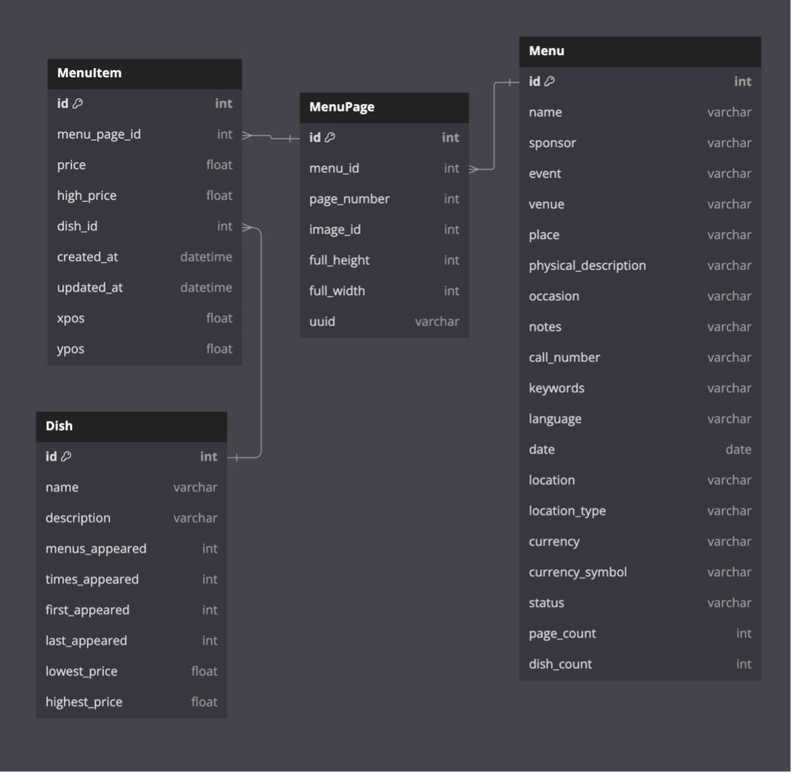

# Dataset Description

[](https://www.mysql.com/)
[](https://en.wikipedia.org/wiki/Entity%E2%80%93relationship_model)
[](https://www.nypl.org/)

## Overview

This document provides a comprehensive description of the NYPL "What's on the Menu?" dataset, including its structure, schema, and relationships. The dataset contains approximately **45,000 historical menus** dating from the 1840s to the present, offering a unique window into culinary and cultural evolution over nearly two centuries.

## Entity-Relationship Diagram (ERD)

The following diagram illustrates the complete database schema for the "What's on the Menu?" dataset:



### Database Schema

The ERD comprises **four main tables**: `Menu`, `MenuPage`, `MenuItem`, and `Dish`. Each table serves a specific purpose in organizing and relating menu data.


## Table Descriptions

### 1. **Menu** Table
**Purpose**: Contains metadata about each menu

| Column | Type | Description | Key |
|--------|------|-------------|-----|
| `id` | `int` | Unique menu identifier | **Primary Key** |
| `name` | `varchar` | Menu name/title | |
| `sponsor` | `varchar` | Menu sponsor | |
| `event` | `varchar` | Associated event | |
| `venue` | `varchar` | Venue information | |
| `place` | `varchar` | Location | |
| `physical_description` | `varchar` | Physical menu description | |
| `occasion` | `varchar` | Occasion for menu | |
| `notes` | `varchar` | Additional notes | |
| `call_number` | `varchar` | Library call number | |
| `keywords` | `varchar` | Related keywords | |
| `language` | `varchar` | Menu language | |
| `date` | `date` | Menu date | |
| `location` | `varchar` | Geographic location | |
| `location_type` | `varchar` | Type of location | |
| `currency` | `varchar` | Currency used | |
| `currency_symbol` | `varchar` | Currency symbol | |
| `status` | `varchar` | Menu status | |
| `page_count` | `int` | Number of pages | |
| `dish_count` | `int` | Number of dishes | |

### 2. **MenuPage** Table
**Purpose**: Information about each page within a menu

| Column | Type | Description | Key |
|--------|------|-------------|-----|
| `id` | `int` | Unique page identifier | **Primary Key** |
| `menu_id` | `int` | Reference to Menu table | **Foreign Key** |
| `page_number` | `int` | Page number within menu | |
| `image_id` | `int` | Associated image identifier | |
| `full_height` | `int` | Page height in pixels | |
| `full_width` | `int` | Page width in pixels | |
| `uuid` | `varchar` | Universal unique identifier | |

### 3. **MenuItem** Table
**Purpose**: Individual items listed on menu pages

| Column | Type | Description | Key |
|--------|------|-------------|-----|
| `id` | `int` | Unique item identifier | **Primary Key** |
| `menu_page_id` | `int` | Reference to MenuPage table | **Foreign Key** |
| `price` | `float` | Item price | |
| `high_price` | `float` | Highest price variant | |
| `dish_id` | `int` | Reference to Dish table | **Foreign Key** |
| `created_at` | `datetime` | Creation timestamp | |
| `updated_at` | `datetime` | Last update timestamp | |
| `xpos` | `float` | X-coordinate position | |
| `ypos` | `float` | Y-coordinate position | |

### 4. **Dish** Table
**Purpose**: Information about specific dishes

| Column | Type | Description | Key |
|--------|------|-------------|-----|
| `id` | `int` | Unique dish identifier | **Primary Key** |
| `name` | `varchar` | Dish name | |
| `description` | `varchar` | Dish description | |
| `menus_appeared` | `int` | Number of menus featuring dish | |
| `times_appeared` | `int` | Total appearances across menus | |
| `first_appeared` | `int` | First year of appearance | |
| `last_appeared` | `int` | Most recent year of appearance | |
| `lowest_price` | `float` | Minimum price recorded | |
| `highest_price` | `float` | Maximum price recorded | |


## Relationships

### Primary Relationships
- **Menu** → **MenuPage** (one-to-many): Each menu can have multiple pages
- **MenuPage** → **MenuItem** (one-to-many): Each page can have multiple menu items  
- **MenuItem** → **Dish** (many-to-one): Each menu item references a specific dish

### Relationship Diagram


### Detailed Relationship Descriptions

#### **Made Up Of** (Menu ↔ MenuPage)
- **Type**: One-to-Many
- **Description**: A menu is composed of one or more pages
- **Cardinality**: 1 Menu : N MenuPages

#### **Consists Of** (MenuPage ↔ MenuItem)
- **Type**: One-to-Many  
- **Description**: A menu page contains one or more menu items
- **Cardinality**: 1 MenuPage : N MenuItems

#### **Has** (Dish ↔ MenuItem)
- **Type**: One-to-Many
- **Description**: A dish can appear as multiple menu items
- **Cardinality**: 1 Dish : N MenuItems


## Database Schema (SQL)

### Dish Table Schema
```sql
Table Dish {
    id int [pk]
    name varchar
    description varchar
    menus_appeared int
    times_appeared int
    first_appeared int 
    last_appeared int 
    lowest_price float
    highest_price float
}
```

### Menu Table Schema
```sql
Table Menu {
    id int [pk]
    name varchar
    sponsor varchar
    event varchar
    venue varchar
    place varchar
    physical_description varchar
    occasion varchar
    notes varchar
    call_number varchar 
    keywords varchar
    language varchar
    date date 
    location varchar
    location_type varchar
    currency varchar
    currency_symbol varchar
    status varchar
    page_count int
    dish_count int
}
```

### MenuItem Table Schema
```sql
Table MenuItem {
    id int [pk]
    menu_page_id int [ref: > MenuPage.id]
    price float 
    high_price float 
    dish_id int [ref: > Dish.id]
    created_at datetime 
    updated_at datetime
    xpos float
    ypos float
}
```

### MenuPage Table Schema
```sql
Table MenuPage {
    id int [pk]
    menu_id int [ref: > Menu.id]
    page_number int
    image_id int
    full_height int
    full_width int
    uuid varchar
}
```


## Narrative Description

### Dataset Background

The **"What's on the Menu?"** dataset is a historical collection curated by the **New York Public Library (NYPL)**. This comprehensive project digitizes and transcribes approximately **45,000 menus** dating from the **1840s to the present day**. The dataset encompasses a wide variety of menus from different types of establishments, events, and geographical locations, capturing the evolution of dining culture over nearly two centuries.

### Dataset Significance

This collection is invaluable for:
- **Historical Research**: Understanding culinary trends over time
- **Cultural Analysis**: Examining dining patterns and preferences
- **Economic Studies**: Analyzing price changes and inflation
- **Social Research**: Investigating dining habits and social customs

### Temporal and Spatial Coverage

- **Temporal Extent**: 1840s to present (180+ years)
- **Geographic Focus**: Primarily United States, with significant New York City representation
- **Establishment Types**: Restaurants, hotels, clubs, events, and special occasions
- **Menu Types**: Dinner, lunch, breakfast, special events, and seasonal menus


## Additional Resources

- **Interactive ERD**: [dbdiagram.io](https://dbdiagram.io/d/RestaurantDefault-63220cfd0911f91ba5af665d)
- **NYPL Data Portal**: [data.nypl.org](https://data.nypl.org/)
- **Project Documentation**: See other documents in this folder


## Dataset Statistics

| Metric | Value |
|--------|-------|
| **Total Menus** | ~45,000 |
| **Total Pages** | ~180,000 |
| **Total Menu Items** | ~1,200,000 |
| **Unique Dishes** | ~400,000 |
| **Date Range** | 1840s - Present |
| **Geographic Coverage** | Global (US-focused) |
| **Languages** | Multiple (English primary) |