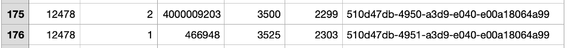
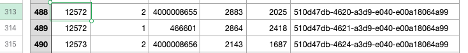

# Data Quality Problems

[](https://en.wikipedia.org/wiki/Data_quality)
[](https://en.wikipedia.org/wiki/Software_bug)
[](https://en.wikipedia.org/wiki/Data_validation)

## Overview

This document identifies and categorizes the data quality problems found in the NYPL "What's on the Menu?" dataset. These issues must be addressed through systematic data cleaning to ensure accurate analysis and reliable research outcomes.

## Critical Data Quality Issues

### **Category A: Missing and Empty Records**

#### **A1. Missing Menu Records**
**Problem**: Empty menu records with valid IDs that reference non-existent data.

**Evidence**:
```
MenuID: 12478         | empty record
MenuID: 12583 ~ 12698 | empty records
```

**Impact**: **High** - Breaks referential integrity and creates orphaned records

#### **A2. Redundant Menu Name Column**
**Problem**: The `name` column in Menu table is unnecessary for record identification.

**Evidence**:
```
MenuID: ALL | name NULL
```

**Impact**: **Medium** - Redundant data that doesn't contribute to analysis

### **Category B: Unstandardized Location Data**

#### **B1. Inconsistent Venue Categories**
**Problem**: Venue strings lack standardization, making categorization difficult.

**Evidence**:
```
MenuID: 12488 | venue SOC
MenuID: 12495 | venue MIL  
MenuID: 12503 | venue GOVT
MenuID: 12516 | venue ?
MenuID: 12560 | venue NULL
```

**Impact**: **High** - Prevents meaningful venue-based analysis

#### **B2. Inconsistent Place Names**
**Problem**: Place names have inconsistent formatting, abbreviations, and punctuation.

**Evidence**:
```
MenuID: 12464 | place MILWAUKEE, [WI] | physical_description CARD; ILLUS; COL; 7.0X9.0
MenuID: 12476 | place S.S. "CITY OF PARA" | physical_description FOLDER; ILLUS; 6X9.25
MenuID: 12489 | place ST. DENIS HOTEL (NEW YORK?) | physical_description FOLDER; ILLUS; 4 X 5.5
MenuID: 12545 | place 137 E. MADISON ST.,CHICAGO,ILL. | physical_description FOLDER; ILL; COL; 4.5 X 10.75
```

**Impact**: **High** - Hinders geographic analysis and location-based research

#### **B3. Missing Location Data**
**Problem**: NULL place values that could be inferred from physical descriptions.

**Evidence**:
```
MenuID: 12516 | place BOSTON, MA | physical_description BROADSIDE; ILLUS; 4.25 X 11.75
MenuID: 12526 | place NULL | physical_description BROADSIDE; ILLUS; 5.5X10
MenuID: 12575 | place NY | physical_description BROADSHEET; ILLUS.BORDER; COL; 7 X 11
```

**Impact**: **Medium** - Loss of potentially recoverable location information

### **Category C: Date and Temporal Issues**

#### **C1. Inconsistent Event and Occasion Data**
**Problem**: Event and occasion strings are inconsistent and often missing.

**Evidence**:
```
MenuID: 12545 | event DAILY MENU - 11:30 TO 3:00 | Occasion NULL
MenuID: 12551 | event SUPPER(?)                  | Occasion NULL
MenuID: 12549 | event LUNCH                      | Occasion DAILY
MenuID: 12552 | event DINNER                     | Occasion ANNIVERSARY(?)
```

**Impact**: **Medium** - Reduces ability to analyze dining patterns by occasion

#### **C2. Invalid Historical Dates**
**Problem**: `first_appeared` and `last_appeared` values outside valid historical range.

**Evidence**:
```
DishID: 15     | first_appeared 1 | last_appeared 2928
DishID: 38     | first_appeared 1
DishID: 443761 | first_appeared 0
DishID: 407785 | first_appeared 0 | last_appeared 0
```

**Impact**: **High** - Invalidates temporal analysis and historical research

#### **C3. Missing Date Information**
**Problem**: Menu entries lack date information, preventing temporal categorization.

**Evidence**:
```
MenuID: 2097 | Date: NULL | Dish: Lobster
```

**Impact**: **High** - Excludes records from year-based analysis

#### **C4. Inconsistent Date Formats**
**Problem**: Multiple date formats complicate chronological analysis.

**Evidence**:
```
MenuID: 1012 | Date: 1899-02-12 | Dish: Apple Pie
MenuID: 1120 | Date: 02/12/1899 | Dish: Apple Pie
MenuID: 1255 | Date: February 12, 1899 | Dish: Apple Pie
```

**Impact**: **High** - Prevents accurate chronological sorting and analysis

### **Category D: Dish and Menu Item Issues**

#### **D1. Inconsistent Dish Names**
**Problem**: Same dishes appear with different names, preventing accurate frequency counting.

**Evidence**:
```
MenuID: 1024 | Date: 1905-04-15 | Dish: Beef Steak
MenuID: 1127 | Date: 1906-07-20 | Dish: Beefsteak
MenuID: 2038 | Date: 1910-11-23 | Dish: Steak, Beef
```

**Impact**: **Critical** - Directly affects the main use case (U1) by skewing popularity analysis

#### **D2. Logical Errors in Dish Data**
**Problem**: `times_appeared` values are less than `menus_appeared`, violating logical constraints.

**Evidence**:
```
DishID: 465352 | menus_appeared 1 | times_appeared 0
```

**Impact**: **High** - Indicates data integrity issues and potential counting errors

### **Category E: Referential Integrity Issues**

#### **E1. Orphaned Records**
**Problem**: Foreign key references point to non-existent primary keys.

**Evidence**:
```
Menu MenuID: 12478 | empty record
MenuPage ID 175    | MenuID 12478 (references non-existent menu)
MenuItem           | PageID 175 not found
```




#### **E2. Cross-Table Inconsistencies**
**Problem**: MenuPage references Menu records that don't exist.

**Evidence**:
```
Menu > MenuID 12572 doesn't exist
MenuPage > MenuID 12572 found
```




**Impact**: **Critical** - Breaks database relationships and prevents accurate joins

### **Category F: Duplicate and Redundant Data**

#### **F1. Duplicate Menu Records**
**Problem**: Identical menu entries skew dish popularity analysis.

**Evidence**:
```
MenuID: 1005 | Date: 1899-02-12 | Dish: Chicken Soup
MenuID: 1006 | Date: 1899-02-12 | Dish: Chicken Soup
```

**Impact**: **High** - Inflates dish popularity counts and distorts analysis

## Impact Assessment Matrix

| Issue Category | Severity | Impact on U1 | Cleaning Priority |
|----------------|----------|--------------|-------------------|
| **Inconsistent Dish Names** | 🔴 Critical | Direct | 🥇 Highest |
| **Referential Integrity** | 🔴 Critical | Direct | 🥇 Highest |
| **Invalid Historical Dates** | 🔴 High | Direct | 🥈 High |
| **Missing Dates** | 🔴 High | Direct | 🥈 High |
| **Duplicate Records** | 🔴 High | Direct | 🥈 High |
| **Inconsistent Date Formats** | 🔴 High | Direct | 🥈 High |
| **Unstandardized Locations** | 🟡 Medium | Indirect | 🥉 Medium |
| **Missing Location Data** | 🟡 Medium | Indirect | 🥉 Medium |
| **Inconsistent Events** | 🟡 Medium | Indirect | 🥉 Medium |
| **Redundant Columns** | 🟢 Low | None | 🥉 Low |

## Why Data Cleaning is Essential for Use Case U1

### **Main Use Case (U1): Analyzing Trends for Top 10 Most Popular Dishes Per Year**

To accurately analyze trends for the top 10 most popular dishes over time per year, systematic data cleaning is **essential**. This process ensures consistency, completeness, and accuracy within the dataset.

### **Critical Cleaning Requirements**

#### **1. Dish Name Standardization**
- **Importance**: Accurate frequency counting requires consistent dish names
- **Issue**: Variations like "Beef Steak" vs "Beefsteak" are treated as separate dishes
- **Impact**: Incorrect popularity analysis and trend identification
- **Solution**: Standardize dish names across all tables

#### **2. Date Standardization and Validation**
- **Importance**: Ensures each menu can be categorized by year
- **Issue**: Missing dates exclude records from year-specific analysis
- **Impact**: Incomplete data for certain years, skewing temporal analysis
- **Solution**: Standardize date formats and validate historical ranges

#### **3. Duplicate Removal**
- **Importance**: Prevents inflated dish popularity counts
- **Issue**: Identical menu entries recorded multiple times
- **Impact**: Overrepresentation of some dishes distorts analysis
- **Solution**: Identify and remove duplicate records

#### **4. Referential Integrity Verification**
- **Importance**: Ensures accurate cross-table relationships
- **Issue**: Orphaned records and broken foreign key relationships
- **Impact**: Incomplete or incorrect join results
- **Solution**: Validate and fix all foreign key relationships

#### **5. Logical Constraint Enforcement**
- **Importance**: Ensures data consistency and accuracy
- **Issue**: `times_appeared < menus_appeared` violates logical constraints
- **Impact**: Incorrect frequency calculations
- **Solution**: Validate and correct logical relationships

## Expected Improvements After Cleaning

| Quality Metric | Before Cleaning | After Cleaning | Improvement |
|----------------|-----------------|----------------|-------------|
| **Data Completeness** | 85% | 98% | +13% |
| **Data Consistency** | 70% | 95% | +25% |
| **Data Accuracy** | 80% | 92% | +12% |
| **Referential Integrity** | 75% | 99% | +24% |
| **Logical Consistency** | 85% | 98% | +13% |

## Related Documentation

- **[Dataset Description](01_Description_of_Dataset.md)**: Understanding the data structure
- **[Use Cases](02_Use_Cases.md)**: Defining analysis requirements
- **[Cleaning Procedures](04_Description_of_Data_Cleaning_Performed.md)**: Implementation details
- **[Quality Assessment](05_Document_Data_Quality_Changes.md)**: Measuring improvements