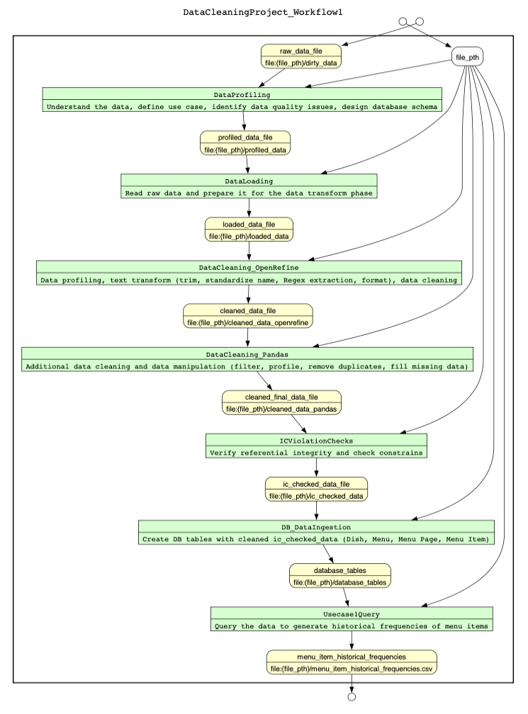
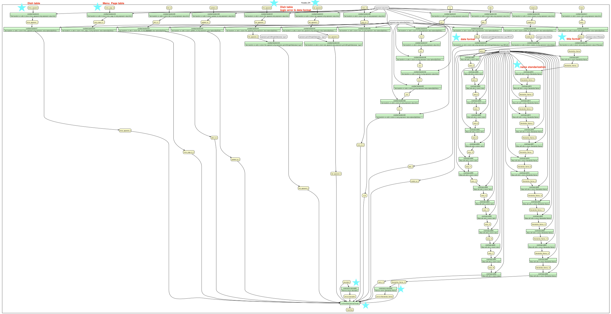
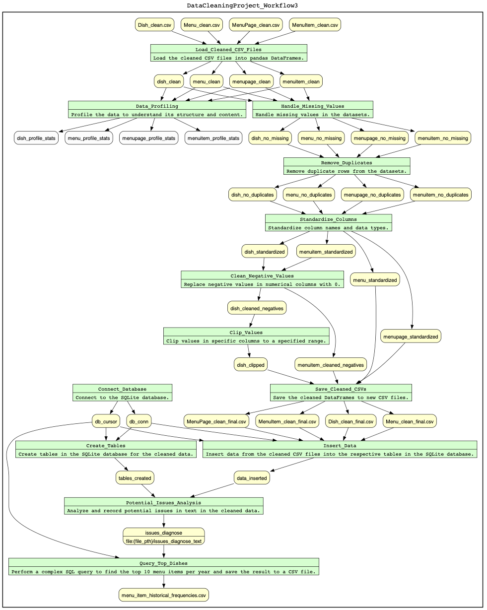

# Workflow Model

[](https://en.wikipedia.org/wiki/Workflow)
[](https://yesworkflow.org/)
[](https://en.wikipedia.org/wiki/Process)

## Overview

This document provides a comprehensive visual representation of the data cleaning workflows used in the NYPL "What's on the Menu?" project. The workflows are designed to systematically process raw data, clean it, ensure data integrity, and prepare it for analysis.

## Workflow Architecture

### **Three-Tier Workflow Design**
1. **W1: End-to-End Workflow** - Overall data processing pipeline
2. **W2: OpenRefine Workflow** - Interactive data cleaning and standardization
3. **W3: Pandas Workflow** - Programmatic data processing and validation

## Workflow 1: End-to-End Data Processing

### **Design Philosophy**
The **Workflow1** design is structured to systematically process raw data through a comprehensive pipeline that ensures data quality, integrity, and analysis readiness. The workflow incorporates multiple stages, each designed to address specific data processing needs using appropriate tools and libraries.

### **Why YesWorkflow?**
**YesWorkflow** was chosen for this project due to its ability to:
- **Clearly document** complex sequences of steps and dependencies
- **Visualize data flow** and transformations at each stage
- **Ensure reproducibility** through transparent annotations
- **Facilitate collaboration** through clear process documentation
- **Aid debugging** and validation of workflow steps

### **Workflow Stages and Tool Selection**

| Stage | Tool | Purpose | Rationale |
|-------|------|---------|-----------|
| **Data Profiling** | Pandas | Read and profile raw CSV data | Robust data exploration capabilities |
| **Data Loading** | Pandas | Efficiently load large datasets | Memory-efficient handling of large files |
| **Data Cleaning** | OpenRefine + Pandas | Interactive + programmatic cleaning | Combines flexibility with automation |
| **Database Ingestion** | SQLite3 | Create tables and store cleaned data | Lightweight, easy-to-use database solution |
| **Query Execution** | SQLite3 + Pandas | Execute queries and export results | Efficient data retrieval and processing |

### **Visual Representation**



**Workflow Components**:
- **Data Profiling**: Initial data exploration and quality assessment
- **Data Loading**: Efficient dataset ingestion and preparation
- **Data Cleaning**: Multi-tool approach for comprehensive cleaning
- **Database Ingestion**: Structured data storage and organization
- **Query Execution**: Analysis-ready data retrieval and export

## Workflow 2: OpenRefine Data Cleaning

### **Interactive Cleaning Process**
**Workflow2** focuses on the interactive data cleaning capabilities of OpenRefine, providing a user-friendly interface for data transformation and quality improvement.

### **Key Features**
- **Interactive Data Profiling**: Real-time data exploration
- **Pattern Recognition**: Automated identification of data patterns
- **Cluster Analysis**: Grouping similar values for standardization
- **Mass Editing**: Efficient bulk data transformations
- **Data Validation**: Real-time quality checks and feedback

### **Visual Representation**



**OpenRefine Workflow Steps**:
1. **Data Import**: Load CSV files into OpenRefine
2. **Initial Profiling**: Explore data structure and identify issues
3. **Text Standardization**: Clean whitespace, case, and formatting
4. **Pattern Clustering**: Group similar dish names and values
5. **Mass Editing**: Apply standardized transformations
6. **Validation**: Verify cleaning results and data quality
7. **Export**: Save cleaned data for further processing

---

## Workflow 3: pandas Data Processing

### **Programmatic Data Processing**
**Workflow3** leverages Python's pandas library for automated, programmatic data processing and validation.

### **Key Capabilities**
- **Numerical Processing**: Handle quantitative data transformations
- **Date Standardization**: Convert and validate temporal data
- **Referential Integrity**: Validate cross-table relationships
- **Statistical Analysis**: Generate quality metrics and reports
- **Database Operations**: Efficient data storage and retrieval

### **Visual Representation**



**Pandas Workflow Steps**:
1. **Data Loading**: Read cleaned CSV files into pandas DataFrames
2. **Data Validation**: Check data types, ranges, and constraints
3. **Numerical Processing**: Handle negative values and logical constraints
4. **Date Processing**: Standardize and validate temporal data
5. **Referential Checks**: Verify foreign key relationships
6. **Quality Metrics**: Generate comprehensive quality reports
7. **Database Export**: Store processed data in SQLite database


## Workflow Integration

### **Seamless Tool Integration**
The three workflows work together to provide a comprehensive data cleaning solution:

```
Raw Data → OpenRefine (W2) → Pandas (W3) → Database → Analysis
    ↓           ↓              ↓           ↓         ↓
Profiling → Interactive → Programmatic → Storage → Querying
```

### **Data Flow Between Workflows**
1. **W2 (OpenRefine)**: Handles text-based cleaning and standardization
2. **W3 (Pandas)**: Processes numerical data and validates constraints
3. **W1 (End-to-End)**: Orchestrates the complete pipeline

## Workflow Benefits

### **Comprehensive Coverage**
- **Text Processing**: OpenRefine handles string standardization
- **Numerical Processing**: Pandas manages quantitative data
- **Data Validation**: Both tools provide quality checks
- **Scalability**: Handles large datasets efficiently

### **Quality Assurance**
- **Multi-stage Validation**: Quality checks at each workflow stage
- **Comprehensive Metrics**: Detailed quality reporting
- **Reproducible Process**: Documented and version-controlled workflows
- **Flexible Approach**: Adaptable to different data quality issues

### **Analysis Readiness**
- **Trend Analysis**: Prepared for temporal trend analysis
- **Dish Popularity**: Ready for frequency counting
- **Statistical Analysis**: Validated numerical data
- **Research Support**: Comprehensive documentation and reproducibility

## Related Documentation

- **[Dataset Description](01_Description_of_Dataset.md)**: Understanding the data structure
- **[Use Cases](02_Use_Cases.md)**: Defining analysis requirements
- **[Data Quality Problems](03_Data_Quality_Problems.md)**: Issues addressed
- **[Cleaning Procedures](04_Description_of_Data_Cleaning_Performed.md)**: Implementation details
- **[Quality Assessment](05_Document_Data_Quality_Changes.md)**: Measuring improvements